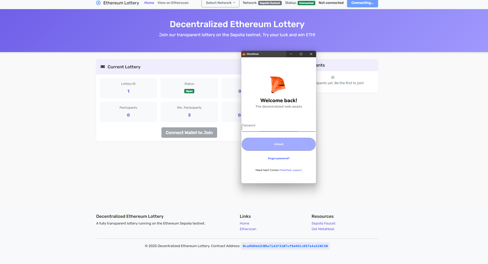
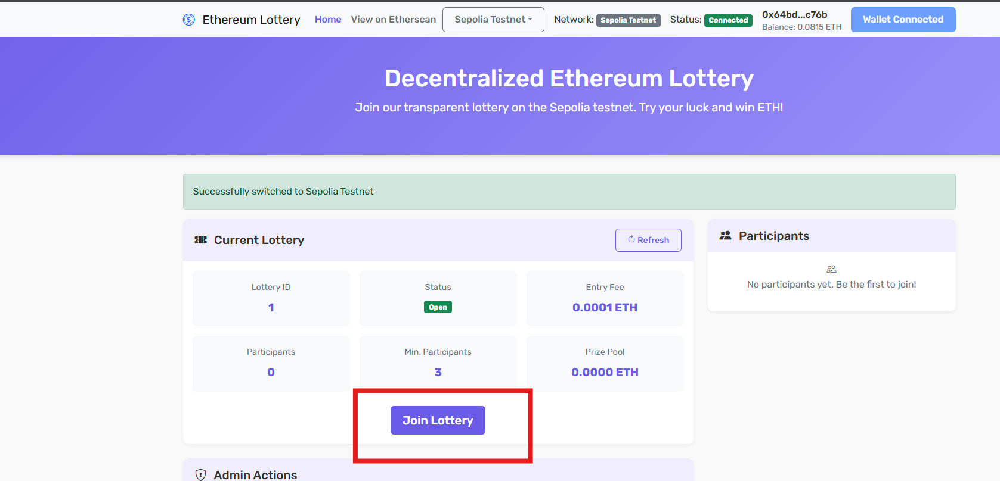
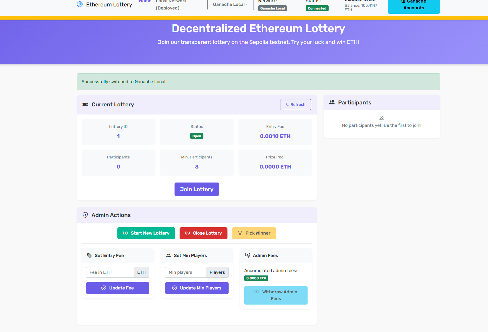
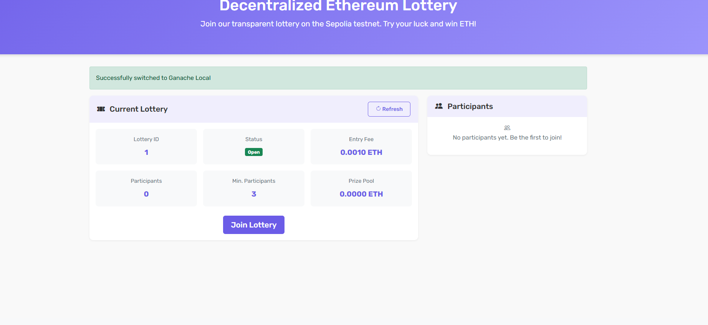
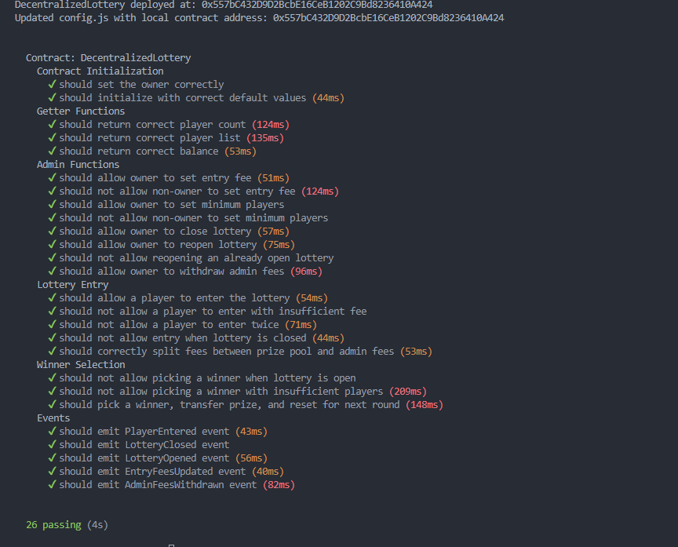

# Decentralized Ethereum Lottery Application - Functionality Report

## Overview
The Decentralized Ethereum Lottery is a blockchain-based application that provides a transparent, trustless lottery system running on the Ethereum network. The application connects users' Ethereum wallets to interact with a smart contract that manages all lottery operations.

## Core Functionality

### User Features
1. **Wallet Integration**
   - Seamless connection with MetaMask wallet
   - Support for network switching between Sepolia testnet and local Ganache
   - Account selection for multiple wallet addresses(Ganache only,for testing purposes)
  
2. **Lottery Participation**
   - Entry into active lotteries by paying the required ETH fee
   - Real-time balance and transaction updates
   - Automatic prize distribution to winners
  

3. **User Interface**
   - Mobile-responsive design for all devices
   - Real-time status updates with visual indicators
   - Automatic refresh functionality eliminating manual updates

### Administrative Features
1. **Lottery Management**
   - Opening and closing lottery rounds
   - Setting entry fees and minimum player requirements
   - Transparent winner selection process
   - Fee withdrawal for platform maintenance

2. **Admin Dashboard**
   - Comprehensive control panel for lottery parameters
   - Real-time statistics and participant tracking
   - Secure admin-only functions with authentication




## Technical Implementation

### Smart Contract
The core logic resides in a Solidity smart contract that:
- Manages participant entries and funds
- Implements secure random winner selection
- Handles prize distribution automatically
- Controls lottery state (open/closed)
- Enforces minimum participant requirements
- Includes admin fee management

### Frontend Application
- Built with HTML5, CSS3, and JavaScript
- Uses Web3.js for blockchain interaction
- Implements Bootstrap 5 for responsive design
- Features asynchronous updates to reflect blockchain state
- Provides separate user and admin interfaces

## Project Architecture

### Current Project Structure

```
Lottery_Project/
├── contracts/                  # Smart contract source files
│   └── DecentralizedLottery.sol   # Main lottery contract
│
├── test/                       # Unit test files
│   └── DecentralizedLottery.test.js  # Smart contract unit tests
│
├── frontend/                   # Web application files
│   ├── index.html              # Main application entry point
│   ├── css/
│   │   └── style.css           # Application styling
│   └── js/
│       ├── app.js              # Application initialization
│       ├── config.js           # Configuration settings
│       ├── contract-interaction.js  # Smart contract interactions
│       ├── event-handlers.js   # Event processing logic
│       ├── ui-controller.js    # UI update management
│       └── web3-provider.js    # Web3 connection handling
│
├── build/                      # Compiled contract artifacts
│   └── contracts/
│       └── DecentralizedLottery.json  # ABI and deployment data
│
├── server.js                   # Express server for local development
│
├── truffle-config.js           # Truffle configuration
│
├── utils.js                    # Utility functions
│
├── .github/workflows/          # CI/CD pipeline configuration
│   └── deploy.yml              # GitHub Pages deployment workflow
│
├── package.json                # Project dependencies
│
└── README.md                   # Project documentation
└── report.md                   # This functionality report
```

### Component Interaction

1. **User Interaction Layer**
   - Browser-based interface for users to interact with the lottery
   - MetaMask integration for transaction signing and wallet management
   - Account selector for multiple address support
   - Real-time UI updates with automatic refresh functionality

2. **Application Layer**
   - Modular JavaScript implementation with separation of concerns:
     - `web3-provider.js`: Handles blockchain connectivity
     - `contract-interaction.js`: Manages smart contract function calls
     - `ui-controller.js`: Controls UI state and presentation
     - `event-handlers.js`: Processes user and contract events
   - Asynchronous operations with error handling for blockchain interactions

3. **Blockchain Layer**
   - `DecentralizedLottery.sol` contract deployed on Ethereum (Sepolia or local Ganache)
   - Functions for lottery entry, administration, and prize distribution
   - Event emission for frontend notifications
   - Secure random winner selection process

4. **Development & Deployment Infrastructure**
   - Truffle framework for contract compilation, testing, and migration
   - GitHub Actions workflow for automated deployment to GitHub Pages
   - Environment-specific configurations for different networks
   - Ganache is used for local development

5. **Manual Testing**
   - Manual testing of all features
   - Tested on Sepolia testnet and local Ganache
   - Tested on different browsers and devices
   - Tested on different wallet providers
   - Tested on different network configurations
   - Tested on different contract addresses
   - Tested on different admin addresses
6. **Unit Testing**
   - Unit tests for smart contract functionality
   - Integration tests for frontend-backend interaction
   - You may find the test code in the test folder
   

### Data Flow

```
User Actions                  Smart Contract Functions           Events
+----------------+            +------------------------+         +------------------+
| Connect Wallet |----------->| getLotteryStatus()     |-------->| UI Updates       |
| Enter Lottery  |----------->| enterLottery()         |-------->| Transaction      |
| Admin Controls |----------->| closeLottery()         |-------->| Notification     |
|                |            | pickWinner()           |-------->|                  |
|                |            | openLottery()          |-------->|                  |
|                |            | withdrawFees()         |-------->|                  |
+----------------+            +------------------------+         +------------------+
```

## Security Measures
- Transparent winner selection using blockchain-based randomness
- Automatic prize distribution without manual intervention
- Protected admin functions with ownership verification
- Complete transaction transparency on the blockchain

## Deployment
The application is deployed on the Ethereum Sepolia testnet with a [live demo](https://johnnysy-dio.github.io/Lottery_Project/frontend/index.html) available, and can also be run locally for development and testing purposes with Ganache.

## Conclusion
The Decentralized Ethereum Lottery provides a complete solution for running transparent, automated lottery systems on blockchain technology. It eliminates traditional concerns about lottery fairness by leveraging Ethereum's decentralized nature while offering intuitive interfaces for both users and administrators. 